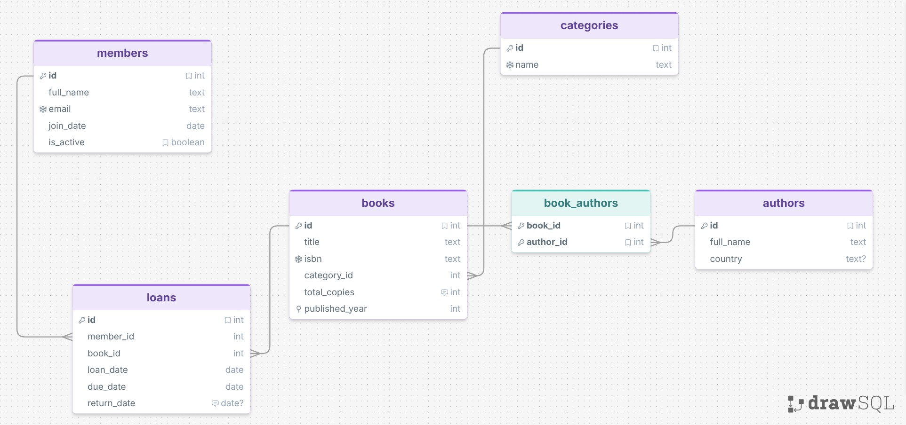

# Library Lending System API

A FastAPI backend for a small library that lends physical books to registered members. Built with FastAPI, SQLAlchemy, and SQLite. Exposes a REST API with full CRUD for books, members, authors, and categories; loan operations; filtered book search; and reports.

## Setup

```bash
# 1. Create and activate a virtual environment
python -m venv .venv
source .venv/bin/activate          # Windows Git Bash: source .venv/Scripts/activate
                                   # Windows PowerShell: .venv\Scripts\Activate.ps1

# 2. Install dependencies
pip install -r requirements.txt

# 3. Apply database migrations
alembic upgrade head

# 4. Seed the database with test data
python scripts/seed.py

# 5. Set the API key (required for write operations)
export API_KEY=dev-secret-key      # Linux/macOS
$env:API_KEY="dev-secret-key"      # Windows PowerShell
set API_KEY=dev-secret-key         # Windows CMD

# 6. Run the development server
uvicorn app.main:app --reload
```

The API will be available at `http://127.0.0.1:8000`.  
Interactive docs (Swagger UI) at `http://127.0.0.1:8000/docs`.

## Run tests

```bash
pytest tests/ -v
```

Tests use an in-memory SQLite database and never touch `library.db`.

## API key

All `POST`, `PATCH`, and `DELETE` endpoints require an `X-API-Key` request header compared against the `API_KEY` environment variable. `GET` endpoints are open with no key required.

If `API_KEY` is not set, the server defaults to `dev-secret-key` (development only).

A missing or wrong key returns `401 Unauthorized`.

## Database schema



Live editable version: [drawSQL](https://drawsql.app/teams/ubejd-morina/diagrams/fastapi)

## Endpoints

- `GET  /api/v1/health` — health check
- `GET/POST/PATCH/DELETE /api/v1/categories` — CRUD for book categories
- `GET/POST/PATCH/DELETE /api/v1/authors` — CRUD for authors
- `GET/POST/PATCH/DELETE /api/v1/members` — CRUD for library members
- `GET/POST/PATCH/DELETE /api/v1/books` — CRUD for books (embeds category and authors)
- `POST /api/v1/loans` — borrow a book
- `POST /api/v1/loans/{id}/return` — return a borrowed book
- `GET  /api/v1/loans` — list loans with filters (member_id, book_id, status)
- `GET  /api/v1/books/search` — filtered, sorted, paginated book search
- `GET  /api/v1/reports/top-borrowers` — top N members by total loans
- `GET  /api/v1/reports/overdue-loans` — all currently overdue loans
- `GET  /api/v1/books/{id}/loan-history` — paginated loan history per book

See `/docs` for the full interactive OpenAPI specification.

## Notes

lighthouse